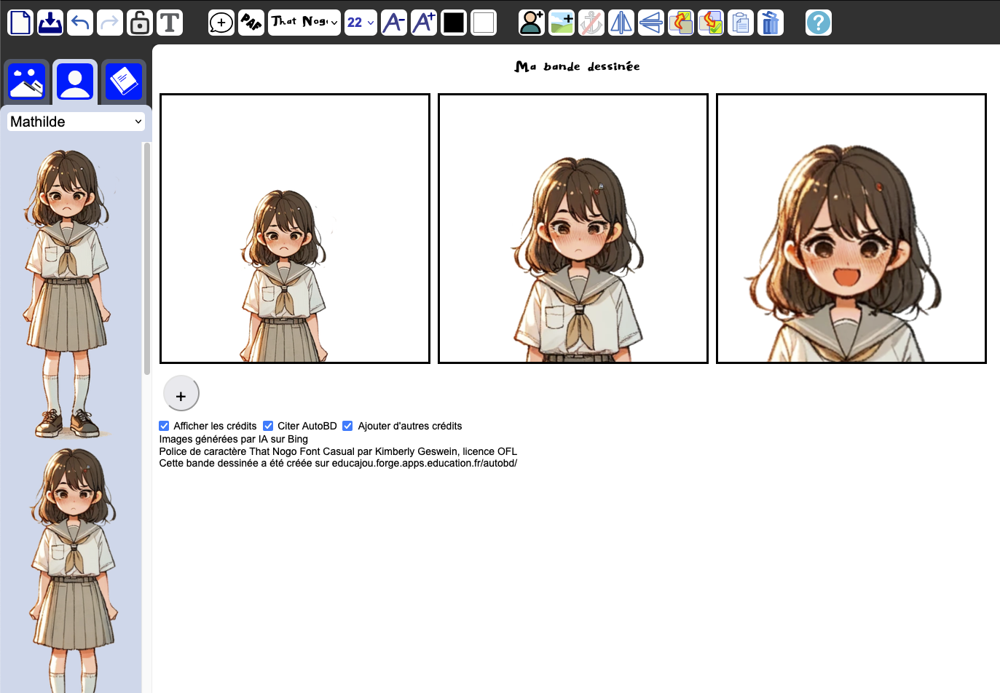

<!--
Este archivo README esta generado automaticamente<https://github.com/YunoHost/apps/tree/master/tools/readme_generator>
No se debe editar a mano.
-->

# AutoBD para Yunohost

[](https://ci-apps.yunohost.org/ci/apps/autobd/)  

[](https://install-app.yunohost.org/?app=autobd)

*[Leer este README en otros idiomas.](./ALL_README.md)*

> *Este paquete le permite instalarAutoBD rapidamente y simplement en un servidor YunoHost.*  
> *Si no tiene YunoHost, visita [the guide](https://yunohost.org/install) para aprender como instalarla.*

## Descripción general

AutoBD makes it easy to create a comic strip and export it as an image. It comes with a collection of freely licensed backgrounds and characters, but you can use your own content from your computer’s storage. The application makes it easy to give credit by automatically adding the appropriate mention as you use the provided drawings. This makes it easier to respect copyright and raises awareness among students.


**Versión actual:** 1.0~ynh2

**Demo:** <https://educajou.forge.apps.education.fr/autobd>

## Capturas



## Documentaciones y recursos

- Repositorio del código fuente oficial de la aplicación : <https://forge.apps.education.fr/educajou/autobd>
- Catálogo YunoHost: <https://apps.yunohost.org/app/autobd>
- Reportar un error: <https://github.com/YunoHost-Apps/autobd_ynh/issues>

## Información para desarrolladores

Por favor enviar sus correcciones a la [rama `testing`](https://github.com/YunoHost-Apps/autobd_ynh/tree/testing).

Para probar la rama `testing`, sigue asÍ:

```bash
sudo yunohost app install https://github.com/YunoHost-Apps/autobd_ynh/tree/testing --debug
o
sudo yunohost app upgrade autobd -u https://github.com/YunoHost-Apps/autobd_ynh/tree/testing --debug
```

**Mas informaciones sobre el empaquetado de aplicaciones:** <https://yunohost.org/packaging_apps>
