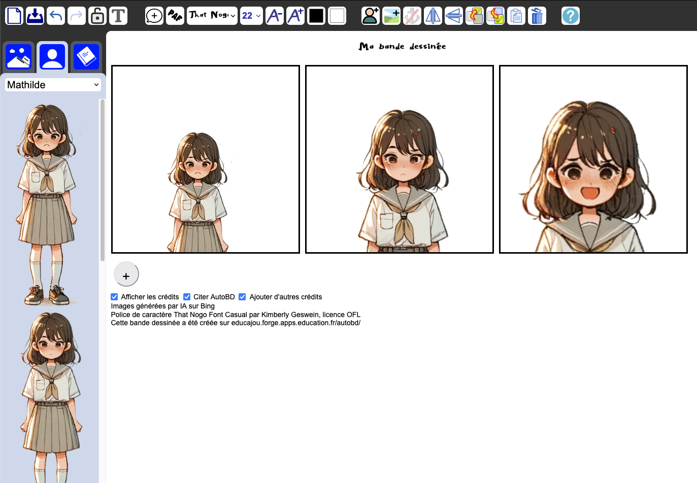

<!--
NOTA: Este README foi creado automáticamente por <https://github.com/YunoHost/apps/tree/master/tools/readme_generator>
NON debe editarse manualmente.
-->

# AutoBD para YunoHost

[](https://ci-apps.yunohost.org/ci/apps/autobd/)  

[](https://install-app.yunohost.org/?app=autobd)

*[Le este README en outros idiomas.](./ALL_README.md)*

> *Este paquete permíteche instalar AutoBD de xeito rápido e doado nun servidor YunoHost.*  
> *Se non usas YunoHost, le a [documentación](https://yunohost.org/install) para saber como instalalo.*

## Vista xeral

AutoBD makes it easy to create a comic strip and export it as an image. It comes with a collection of freely licensed backgrounds and characters, but you can use your own content from your computer’s storage. The application makes it easy to give credit by automatically adding the appropriate mention as you use the provided drawings. This makes it easier to respect copyright and raises awareness among students.


**Versión proporcionada:** 1.0~ynh1

**Demo:** <https://educajou.forge.apps.education.fr/autobd>

## Capturas de pantalla



## Documentación e recursos

- Repositorio de orixe do código: <https://forge.apps.education.fr/educajou/autobd>
- Tenda YunoHost: <https://apps.yunohost.org/app/autobd>
- Informar dun problema: <https://github.com/YunoHost-Apps/autobd_ynh/issues>

## Info de desenvolvemento

Envía a túa colaboración á [rama `testing`](https://github.com/YunoHost-Apps/autobd_ynh/tree/testing).

Para probar a rama `testing`, procede deste xeito:

```bash
sudo yunohost app install https://github.com/YunoHost-Apps/autobd_ynh/tree/testing --debug
ou
sudo yunohost app upgrade autobd -u https://github.com/YunoHost-Apps/autobd_ynh/tree/testing --debug
```

**Máis info sobre o empaquetado da app:** <https://yunohost.org/packaging_apps>
